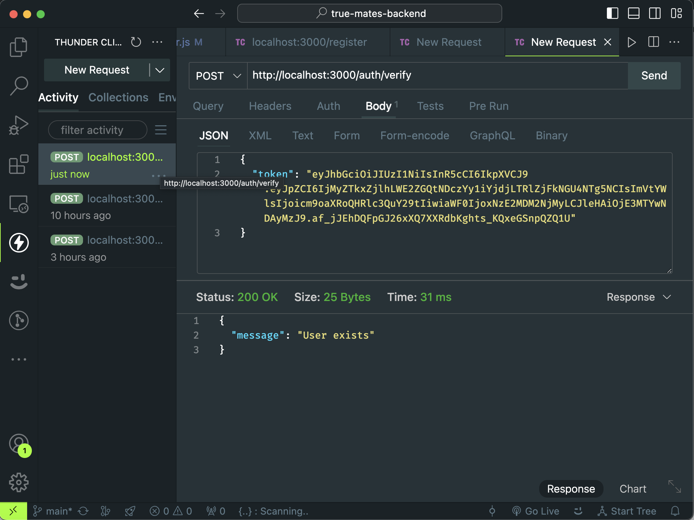

# True Mates Backend Challenge

This repository contains the backend code for the True Mates Backend Developer Intern Challenge. The backend is developed using Node.js, Express.js, Sequelize, JWT, and interacts with GCP Storage and PostgreSQL.

## Project Structure

```
true_mates_backend_challenge/
│
├── config/
│   └── config.json            (Database configuration)
│
├── migrations/
│   ├── 20240516233403-create_user_table.js
│   ├── 20240516233410-create_post_table.js
│   └── 20240516233416-create_friend_table.js
│
├── src/
│   ├── config/
│   │   └── database.js        (Database connection setup)
│   │
│   ├── controllers/
│   │   ├── authController.js  (Controller for user authentication)
│   │   ├── postController.js  (Controller for post-related operations)
│   │   └── friendsController.js  (Controller for friend-related operations)
│   │
│   ├── models/
│   │   ├── user.js            (User model definition)
│   │   ├── post.js            (Post model definition)
│   │   └── friend.js          (Friend model definition)
│   │
│   ├── routes/
│   │   ├── authRoutes.js      (Routes for user authentication)
│   │   ├── postRoutes.js      (Routes for post-related operations)
│   │   └── friendsRoutes.js   (Routes for friend-related operations)
│   │
│   ├── uploads/               (Directory to store uploaded files)
│   │
│   └── utils/
│       └── storageUtil.js     (Utility functions for interacting with GCP Storage)
│
├── .env                       (Environment variables)
├── app.js                     (Entry point of the application)
└── package.json               (Project dependencies and scripts)
```

#### Note:

- I understand that some parts of the code may not be consistent, for example, I know how to add middleware for each route and pass authorization tokens as cookies or in headers. I can also pass a few values in query parameters and search parameters instead of passing them through the body of the API. I totally understand that I just want to show different possible combinations. I am confident that when I am in a business setting, I will follow the standards of the project. However, the specific implementation depends on the data sent from the frontend and the business logic requirements. I am familiar with good practices and industry standards, and I can apply them accordingly.

## Installation

1. Clone the repository:

```bash
git clone https://github.com/rohithgoud30/true_mates_backend_challenge.git
```

2. Install dependencies:

```bash
cd true_mates_backend_challenge
npm install
```

## Environment Variables

Create a `.env` file in the root directory and provide the following environment variables:

```plaintext
PORT=3000
DB_USERNAME=your_database_username
DB_PASSWORD=your_database_password
DB_NAME=your_database_name
DB_HOST=your_database_host
DB_DIALECT=postgres
JWT_SECRET=your_jwt_secret
BUCKET_NAME=your_gcp_storage_bucket_name
PROJECT_ID=your_gcp_project_id
KEYFILENAME=your_gcp_keyfile_name
```

## Running the Application

Run the following command to start the server:

```bash
npm run server
```

## API Endpoints

- `/auth/register`: POST - Route for user registration


- `/auth/login`: POST - Route for user login


- `/auth/verify`: POST - Route to verify user existence



- `/posts`: POST - Route to create a new post


- `/posts/:id`: PUT - Route to edit an existing post


- `/posts/:id`: GET - Route to retrieve a post by its ID


- `/posts`: GET - Route to retrieve all posts


- `/posts?page=${page}&pageSize=${pageSize}`: GET - Route to retrive all posts with pagination


- `/friends/search?searchQuery=${searchQuery}`: POST - Route for searching users


- `/friends/add`: POST - Route for adding friends


## Database Migration Documentation

### Steps Followed:

1. **Install Sequelize CLI:**

   ```bash
   npm install -g sequelize-cli
   ```

2. **Initialize Sequelize:**

   ```bash
   sequelize init
   ```

   This command initializes Sequelize in the project directory and creates the necessary folder structure.

3. **Create Migration Files:**
   For each table in the database (User, Post, Friend), migration files were created using the following commands:

   ```bash
   sequelize migration:create --name create_user_table
   sequelize migration:create --name create_post_table
   sequelize migration:create --name create_friend_table
   ```

   This generated migration files with the names:

   - `20240516233403-create_user_table.js`
   - `20240516233410-create_post_table.js`
   - `20240516233416-create_friend_table.js`

4. **Edit `config.json`:**
   The `config.json` file in the `config` folder was modified to include environment-specific database configurations:

   ```json
   {
     "development": {
       "username": "your_dev_username",
       "password": "your_dev_password",
       "database": "your_dev_database_name",
       "host": "your_dev_host",
       "dialect": "postgres"
     },
     "test": {
       "username": "your_test_username",
       "password": "your_test_password",
       "database": "your_test_database_name",
       "host": "your_test_host",
       "dialect": "postgres"
     },
     "production": {
       "username": "your_prod_username",
       "password": "your_prod_password",
       "database": "your_prod_database_name",
       "host": "your_prod_host",
       "dialect": "postgres"
     }
   }
   ```

5. **Run Migrations:**
   To apply the migrations and create the database tables, the following command was executed:

   ```bash
   sequelize db:migrate
   ```

6. **Revert Migrations:**
   To revert the migrations and undo the changes made to the database schema, the following command was used:
   ```bash
   sequelize db:migrate:undo
   ```

#### Notes:

- Sequelize CLI was used to generate migration files for each table in the database.
- Environment-specific database configurations were defined in the `config.json` file.
- Migrations were applied using `sequelize db:migrate`, and they can be reverted using `sequelize db:migrate:undo`.
